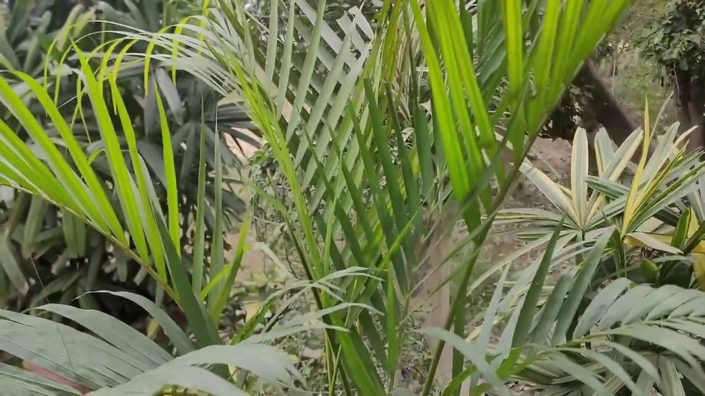

# 🌿 Plant-Species-Image-Classification

**Predicting plant images**

---

## A. Project Overview

This project focuses on building an **image classification model** capable of identifying **20 different plant species** using images.  
The model was trained using **Google Teachable Machine**, leveraging **transfer learning** to efficiently classify plant images with high accuracy.

### Purpose of the Image Classification Model
- Automatically recognize plant species from images  
- Assist in plant identification and educational use  
- Demonstrate the practical application of machine learning for image classification  

---

## B. Plant Species Section

Below are the **20 plant species** used in the model.  
Each class contains **250 images** for training.

---

### 1. Areca Palm

  

- **Common Name:** Areca Palm  
- **Scientific Name:** *Dypsis lutescens*  
- **Description:** A tropical palm with feathery, arching fronds commonly used as an indoor ornamental plant.

### 2. Begonias
- **Common Name:** Begonia  
- **Scientific Name:** *Begonia spp.*  
- **Description:** A flowering plant known for its colorful leaves and blooms, often grown indoors or in gardens.

### 3. Bougainvillea Plant
- **Common Name:** Bougainvillea  
- **Scientific Name:** *Bougainvillea spp.*  
- **Description:** A climbing plant with vibrant, paper-like bracts commonly found in tropical climates.

### 4. Cacti
- **Common Name:** Cactus  
- **Scientific Name:** *Cactaceae family*  
- **Description:** A desert plant adapted to arid environments, characterized by thick stems and spines.

### 5. Crocus Plant
- **Common Name:** Crocus  
- **Scientific Name:** *Crocus spp.*  
- **Description:** A small flowering plant that blooms early in spring, known for its bright, cup-shaped flowers.

### 6. Crotons
- **Common Name:** Croton  
- **Scientific Name:** *Codiaeum variegatum*  
- **Description:** A decorative plant with colorful, variegated leaves often used indoors or outdoors.

### 7. Daylily
- **Common Name:** Daylily  
- **Scientific Name:** *Hemerocallis spp.*  
- **Description:** A flowering plant whose blooms typically last only one day, available in many colors.

### 8. Eryngium
- **Common Name:** Sea Holly  
- **Scientific Name:** *Eryngium spp.*  
- **Description:** A spiky ornamental plant with blue or silver flowers, often used in floral arrangements.

### 9. Hibiscus
- **Common Name:** Hibiscus  
- **Scientific Name:** *Hibiscus rosa-sinensis*  
- **Description:** A tropical flowering plant known for its large, colorful blooms.

### 10. Jade Plant
- **Common Name:** Jade Plant  
- **Scientific Name:** *Crassula ovata*  
- **Description:** A succulent plant with thick, glossy leaves, often associated with good luck.

### 11. Jasmine
- **Common Name:** Jasmine  
- **Scientific Name:** *Jasminum spp.*  
- **Description:** A fragrant flowering plant commonly used in perfumes and teas.

### 12. Lantana
- **Common Name:** Lantana  
- **Scientific Name:** *Lantana camara*  
- **Description:** A hardy flowering plant with clusters of small, colorful flowers.

### 13. Marigolds
- **Common Name:** Marigold  
- **Scientific Name:** *Tagetes spp.*  
- **Description:** A bright flowering plant commonly used in gardens and cultural events.

### 14. Monstera Dziurawa
- **Common Name:** Monstera  
- **Scientific Name:** *Monstera deliciosa*  
- **Description:** A popular houseplant with large, split leaves and a tropical appearance.

### 15. Peace Lily
- **Common Name:** Peace Lily  
- **Scientific Name:** *Spathiphyllum spp.*  
- **Description:** An indoor plant known for its white flowers and air-purifying qualities.

### 16. Snake Plant
- **Common Name:** Snake Plant  
- **Scientific Name:** *Dracaena trifasciata*  
- **Description:** A low-maintenance indoor plant with upright, sword-like leaves.

### 17. Spider Plant
- **Common Name:** Spider Plant  
- **Scientific Name:** *Chlorophytum comosum*  
- **Description:** A fast-growing indoor plant with long, arching leaves and baby offshoots.

### 18. Ti Plant
- **Common Name:** Ti Plant  
- **Scientific Name:** *Cordyline fruticosa*  
- **Description:** A tropical plant with colorful foliage often used as an ornamental plant.

### 19. Tulips
- **Common Name:** Tulip  
- **Scientific Name:** *Tulipa spp.*  
- **Description:** A spring-blooming flower known for its cup-shaped petals and vibrant colors.

### 20. Zinnia Plant
- **Common Name:** Zinnia  
- **Scientific Name:** *Zinnia elegans*  
- **Description:** A bright, hardy flowering plant commonly used in gardens.

---

## C. Model Training Details

| Parameter | Value |
|--------|------|
| Epochs | 50 |
| Batch Size | 32 |
| Learning Rate | Automatically optimized (Teachable Machine) |
| Number of Images per Class | 250 |
| Total Images | 5,000 |
| Model Type | Image Classification (Transfer Learning – MobileNet) |

---

## D. Model Evaluation

The model was evaluated using the following metrics:
- **Confusion Matrix**
- **Accuracy per Class**
- **Overall Model Accuracy**

(Screenshots are included in the repository.)

---

## E. Model Testing (Preview Results)

Below are **10 testing screenshots** taken from the **Teachable Machine Preview** section to demonstrate real-time classification performance.

(Screenshots are included in the repository.)

---
